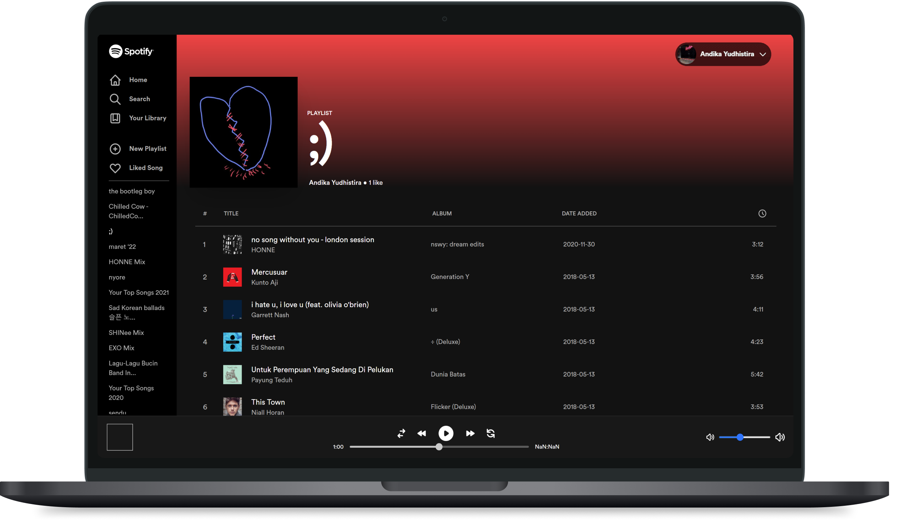

# Spotify Web 'Player'



This project was made with NextJS, recoil for the state management, and TailwindCSS for styling. This portfolio project still on progress to create spotify's comprehensive feature. There will be few bugs/error here and there but i'm trying to fix it!

## Preview of the Web

You can access the preview of this project in [Here](http://andikay.me)

## How to use

If you want to build it from scratch, use [`create-next-app`](https://github.com/vercel/next.js/tree/canary/packages/create-next-app) with [npm](https://docs.npmjs.com/cli/init) or [Yarn](https://yarnpkg.com/lang/en/docs/cli/create/) to bootstrap the example. You can also clone the project

```bash
npm install
```

After that run the project with

```bash
npm run dev
```
